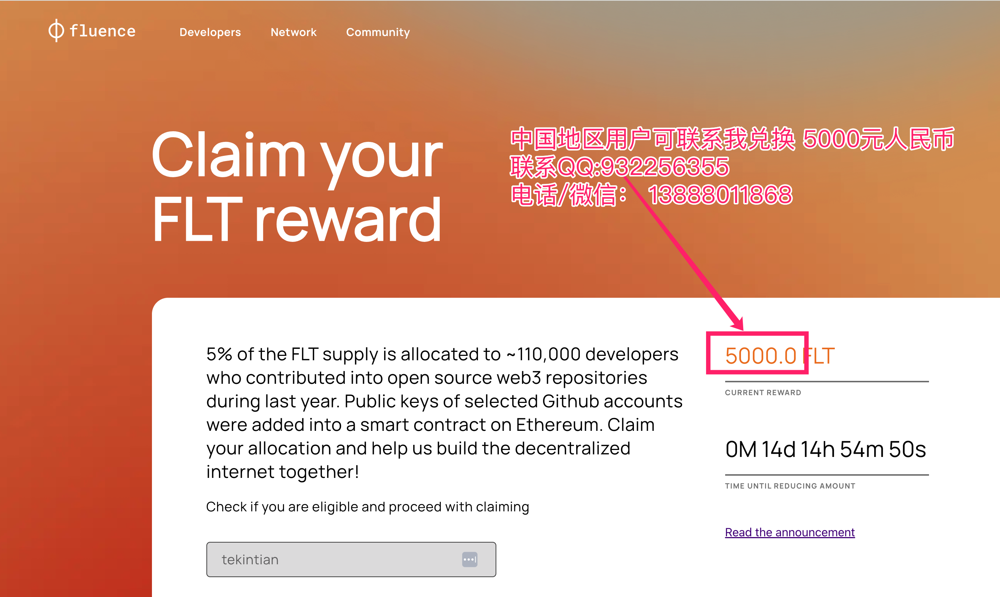
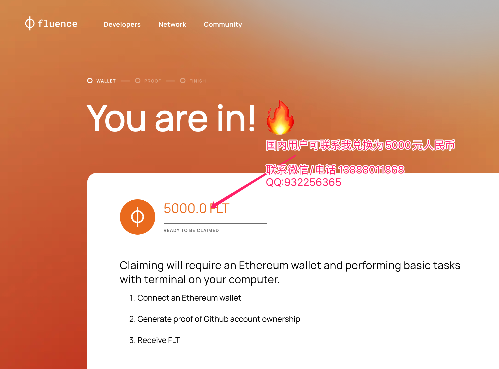

# Github开发者Fluence开发者奖励领取工具

本工具允许开发者创建一个用于领取Fluence开发者奖励的签名proof

如有问题可通过QQ 932256355 或者邮件 tekintian@gmail.com 联系获取技术支持或者奖励领取帮助。

## 领取步骤：

登录 https://claim.fluence.network  查询是否有领取资格

## 如果有领取资格在下载本工具生成proofs

# Fluence Developer Rewards

This repo allows one to generate a proof signature for Fluence dev reward claiming.

> [!CAUTION]
> Beware of scam emails, asking you to generate proofs for someone! See [#98](https://github.com/fluencelabs/dev-rewards/pull/98).

The methods for generating signature are described below:

## Generate proof in docker

1. Build docker image

   > `docker build -t dev-reward-script .`

2. If your ssh keys are in ~/.ssh, run the script:

   > `docker run -it --rm --network none -v ~/.ssh:/root/.ssh:ro dev-reward-script`

   If your ssh keys are in other directories, replace
   {dir_path_for_your_ssh_keys} with your directory path:

   > `docker run -it --rm --network none -v /{dir_path_for_your_ssh_keys}:/root/.ssh:ro dev-reward-script`

## Generate proof via local sh script

1. Install dependencies

   > `./install.sh`

2. Run the script

   > `./proof-sh/proof.sh`

## Generate proof via local python script

1. Install python

   > https://www.python.org/downloads/

2. Install dependencies

   > `./install.sh`

   > `python3 -m venv claim-venv`

   > `source claim-venv/bin/activate`

   > `pip3 install -r python/requirements.txt`

3. Run the script

   > `python3 python/proof.py`

## Generate proof through a website

1. Enter the `web` directory

    > cd web

2. Download the metadata.json file

    > curl https://fluence-dao.s3.eu-west-1.amazonaws.com/metadata.json > metadata.json

3. Spin up an HTTP server

    > python3 -m http.server

4. Open `http://127.0.0.1:8000` in your browser and follow the instructions

## Notes:

Also check out [paranoid](./MANUAL_INSTRUCTIONS.md) instruction
in case you have any security concerns regarding the methods above.
